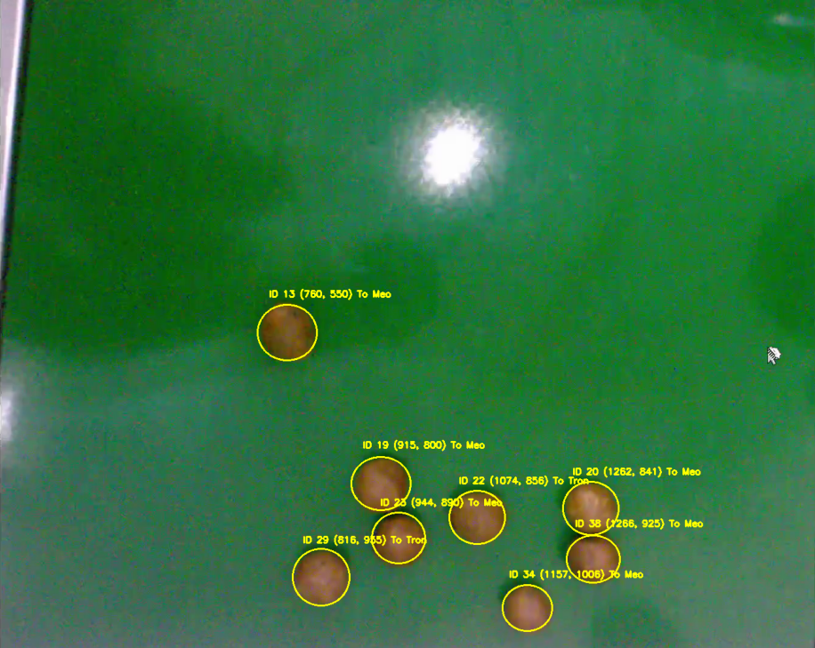

# Cashew Nut Detection and Classification System

A real-time system using YOLOv8 and OpenCV for detecting, tracking, and classifying cashew nuts in video streams.


*System architecture and workflow*

## Key Features

- Cashew nut detection using YOLOv8
- Color and shape analysis
- Frame-by-frame tracking
- Size (Large/Small) and shape (Round/Irregular) classification
- Visual output with ID and detailed information

## System Requirements

```bash
pip install -r requirements.txt
```

Required packages in requirements.txt:
```
ultralytics
opencv-python
numpy
matplotlib
```

## Training Process

1. Data Collection:
   - Recording cashew nuts under different lighting conditions
   - Capturing images from various angles
   - Data labeling using LabelImg or CVAT

2. Data Preparation:
   - Splitting dataset into train/val/test (70/20/10)
   - Converting annotations to YOLO format
   - Data augmentation for increased diversity

3. Training:
   - Using YOLOv8 with pretrained weights
   - Fine-tuning on custom dataset
   - Monitoring training metrics
   - Saving best model based on validation performance

## Detailed Training Guide

### 1. Model Preparation
```bash
# Install YOLOv8
pip install ultralytics

# Download YOLOv8n base model
yolo detect train model=yolov8n.pt
```

### 2. Data Preparation and Training

#### 2.1 Label Verification
```bash
# Create dataset structure
dataset/
├── train/
│   ├── images/
│   └── labels/
└── val/
    ├── images/
    └── labels/

# Verify labels using CVAT or LabelImg
python verify_labels.py --data-path dataset/train/labels
```

Key points for labeling:
- Use consistent labeling conventions
- Ensure bounding boxes are tight around nuts
- Check for missing or incorrect labels
- Verify class consistency

#### 2.2 Data Augmentation
```python
# Example augmentation configuration in data.yaml
augmentation:
  hsv_h: 0.015  # Hue augmentation
  hsv_s: 0.7    # Saturation augmentation
  hsv_v: 0.4    # Value augmentation
  degrees: 180   # Rotation
  translate: 0.1 # Translation
  scale: 0.5    # Scale
  shear: 0.0    # Shear
  flipud: 0.0   # Vertical flip
  fliplr: 0.5   # Horizontal flip
  mosaic: 1.0   # Mosaic augmentation
  mixup: 0.0    # Mixup augmentation
```

#### 2.3 Dataset Split
```bash
# Split dataset (70% train, 30% val)
python split_dataset.py \
    --source-dir dataset/all \
    --train-dir dataset/train \
    --val-dir dataset/val \
    --split-ratio 0.7
```

#### 2.4 Training Configuration
Create `cashew.yaml`:
```yaml
path: dataset  # dataset root dir
train: train/images  # train images
val: val/images      # val images

# Classes
names:
  0: cashew

# Training parameters
epochs: 100
batch_size: 16
imgsz: 640
```

#### 2.5 Model Training
```bash
# Start training
yolo detect train \
    model=yolov8n.pt \
    data=cashew.yaml \
    epochs=100 \
    imgsz=640 \
    batch=16 \
    name=cashew_detector
```

Training monitoring:
- Check Tensorboard logs: `tensorboard --logdir runs/detect/train`
- Monitor metrics in `runs/detect/train/results.csv`
- Best model saved as `best.pt`

### 3. Model Evaluation

#### 3.1 Validation Metrics
```bash
# Evaluate on validation set
yolo detect val \
    model=runs/detect/cashew_detector/weights/best.pt \
    data=cashew.yaml
```

Key metrics to monitor:
- mAP50-95: Mean Average Precision
- Precision
- Recall
- F1-score

#### 3.2 Real-time Testing
Test the model with trackingvideo.py:
```bash
# Modify model path in trackingvideo.py
detector = ObjectDetector("runs/detect/cashew_detector/weights/best.pt", config)

# Run testing
python trackingvideo.py
```

Evaluation criteria:
1. Detection Performance:
   - Accuracy in different lighting conditions
   - Handling of overlapping nuts
   - False positive/negative rate

2. Tracking Stability:
   - ID consistency across frames
   - Handling of occlusions
   - Track maintenance in motion

3. Classification Accuracy:
   - Size classification (Large/Small)
   - Shape classification (Round/Irregular)
   - Color analysis accuracy

4. Processing Speed:
   - FPS on target hardware
   - Latency measurements
   - Resource utilization

### 4. Performance Optimization

If needed, improve model performance by:
1. Increasing training data diversity
2. Adjusting augmentation parameters
3. Fine-tuning model hyperparameters
4. Optimizing inference parameters in Config class

## Usage

1. Install dependencies:
```bash
pip install -r requirements.txt
```

2. Run the program:
```bash
python trackingvideo.py
```

3. Adjustable parameters in Config class:
   - CONF_THRESHOLD: Confidence threshold (default: 0.3)
   - BROWN_THRESHOLD: Brown color ratio threshold (default: 0.1)
   - SIZE_MIN/MAX: Size limits for nuts
   - HW_DIFF_THRESHOLD: Threshold for round/irregular classification

## Demo Results

When running `trackingvideo.py`, the system will:
1. Display video with information:
   - Bounding box and ID for each nut
   - Center coordinates
   - Size classification (Large/Small)
   - Shape classification (Round/Irregular)

2. Detailed terminal logging:
   - Nut area
   - Brown color ratio
   - Detection confidence
   - Geometric parameters

## Code Structure

- **Config**: System parameter management
- **ObjectDetector**: Cashew nut detection and analysis
- **ObjectTracker**: Frame-by-frame tracking
- **Visualizer**: Visual output display

## Performance Metrics

The best_model_9.pt achieves:
- Detection accuracy: >90%
- Processing speed: ~20-30 FPS
- Size classification accuracy: >85%
- Stable tracking across frames

## Important Notes

- Ensure adequate and stable lighting
- Adjust camera for optimal viewing angle
- Parameters in Config can be adjusted for specific conditions

